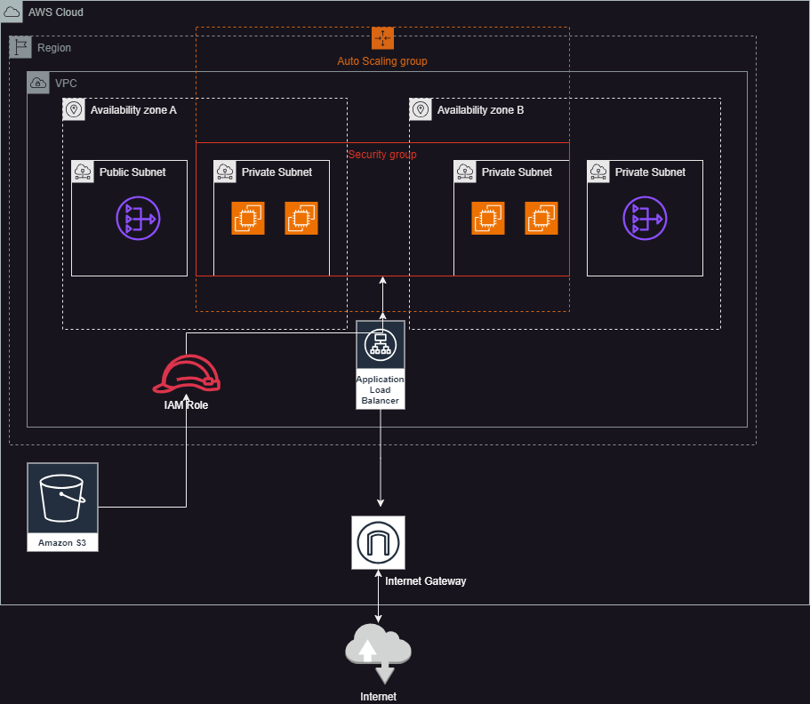

# Deploy a High-Availability Web App Using CloudFormation

# Overview
This project involves deploying a high-availability web application using AWS CloudFormation. The infrastructure setup includes network resources, EC2 instances, a Load Balancer, S3 buckets, security groups, and auto-scaling for the web servers. The goal is to create a scalable solution that serves static content, provides redundancy, and ensures high availability.

# Infrastructure Diagram
An infrastructure diagram has been created to illustrate the AWS resources involved in this project. The diagram includes the following resources:

# Network Resources:

# VPC
Subnets (two public and two private subnets for high availability)
Internet Gateway
NAT Gateways
EC2 Resources:

# Auto Scaling Group with EC2 instances
Application Load Balancer
Security Groups
Static Content Storage:

# S3 Bucket for storing static content
The diagram shows the relationships between these resources (e.g., the Load Balancer connects to EC2 instances, the EC2 instances access the S3 bucket for static content).

# Network and Servers Configuration
VPC & Subnets:
The infrastructure is deployed within a VPC that includes four subnets: two public and two private for high availability.

# Internet and NAT Gateways:

An Internet Gateway is attached to the VPC for public internet access.
NAT Gateways are used to provide internet access to private subnets.
Auto Scaling Group:

# The Auto Scaling Group uses Launch Templates to deploy EC2 instances.
t2.micro instances with Ubuntu 22 are used for the application servers.
Two instances are deployed in each of the private subnets.
Load Balancer:
The Application Load Balancer (ALB) is exposed to the internet on port 80 and routes traffic to the EC2 instances.

# S3 Bucket:
A public-read S3 bucket is used for storing static content. The EC2 instances have an IAM role allowing read and write permissions to the bucket.

# CloudFormation Templates
Networking Stack
The networking stack contains resources to set up the VPC, subnets, internet gateway, and NAT gateways.

# Outputs:

VPC ID
Subnet IDs
These outputs are imported into the application stack to set the correct VPC and subnets for the resources.

Application Stack
The application stack contains resources specific to the application, including:

EC2 instances
Application Load Balancer
Auto Scaling Group
S3 Bucket
Security Groups
The stack uses outputs from the networking stack to configure the correct VPC and subnets.

# Output:

Public URL of Load Balancer:
The Load Balancer DNS name is output with http:// added for convenience, so the public URL is easily accessible.
Security Groups
Security groups are configured following the least privilege principle.

# EC2 Instances:

Allow inbound traffic on port 80 for HTTP communication with the Load Balancer.
Allow unrestricted outbound access for updates and internet access.
Load Balancer:

Allow inbound traffic from any source (0.0.0.0/0) on port 80.
Scripts for Automation
Automation scripts are provided to create and destroy the infrastructure without UI interaction. The scripts can be written in Bash or Python (Boto3), and they use the CloudFormation CLI to deploy the templates.

# Deployment Script Example (Bash)
bash
Copy
#!/bin/bash
aws cloudformation deploy --template-file network-stack.yaml --stack-name my-network-stack --capabilities CAPABILITY_IAM
aws cloudformation deploy --template-file app-stack.yaml --stack-name my-app-stack --capabilities CAPABILITY_IAM --parameter-overrides VPCID=<vpc-id> SubnetIDs=<subnet-ids>
Working Test
After deploying the infrastructure, you can test the setup by visiting the public URL of the Load Balancer.

If the infrastructure is set up correctly, you should see the following message on the webpage:

nginx
Copy
It works! Udagram, Udacity
Requirements

# Parameters
Use as many parameters as necessary, but try to keep them manageable (ideally not too many).
Example: CIDR blocks for VPC, subnet configurations, etc.
Resources
EC2 Instances: Should meet the minimum requirements (t2.micro or better).
Load Balancer: Must be configured with a Target Group, Health Check, and Listener.
Conclusion
This README outlines the necessary steps for deploying a high-availability web application using CloudFormation. The infrastructure includes networking resources, EC2 instances in an Auto Scaling group, an Application Load Balancer, and an S3 bucket for static content. CloudFormation templates, security group configurations, and automation scripts are provided to facilitate the creation and deletion of the entire infrastructure.

## Spin up instructions
1. change directory (cd) to starter root
2. execute command- ./create.sh networkinfra network.yml network-paramters.json
3. when networkinfra stack is created, execute command- ./create.sh udagraminfra udagram.yml udagram-parameters.json to create second stack. 

## Tear down instructions
1. execute command- aws cloudformation delete-stack --stack-name udagraminfra
2. When network stack is deleted, execute command- aws cloudformation delete-stack --stack-name networkinfra

## URL verifying servers are running properly

---

